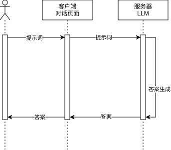
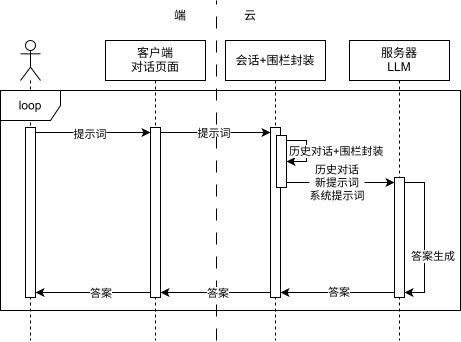
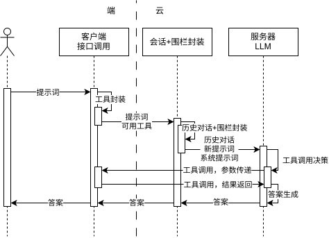
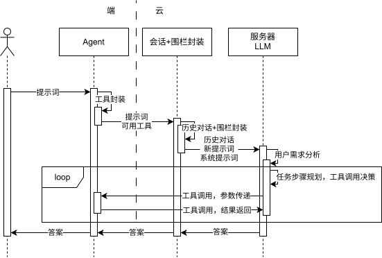

智能体架构导论 自2025年起，围绕大语言模型（LLM）的各类周边应用如雨后春笋般涌现，而这些应用最终都殊途同归地指向了智能体（Agent）方向。本文将从软件工程视角切入，探讨LLM相关的工程架构问题，剖析智能体的架构逻辑。需要说明的是，人工智能（AI）与智能体（Agent）均属于新兴领域，相关技术与架构仍在快速演进中。 
# 1. LLM基础架构
从软件工程视角来看，最基础的LLM架构仅包含三个核心元素：用户、客户端与服务器。 
  
 大模型的底层运行逻辑，本质是基于前序文本的概率分布生成下一个词汇。大模型的的核心概念：Token， 是大模型处理、理解与生成文本的**最小基本单元**，并非传统意义上的汉字或单词 —— 中文语境下，1 个汉字、标点通常对应 1 个 Token，英文则会按词根、文字片段拆分。大模型不直接识别自然语言文字，仅以 Token 为单位运算，其核心运行逻辑，正是基于前文的 Token 序列，预测生成下一个概率最高的 Token，最终拼接为连贯文本。

即便不深入理解大模型的底层原理，也只需明确核心特征——大模型本质是一个**无状态**的文本续写器。具体而言，当用户输入一段文本时，它会基于概率生成契合语境的后续文本。比如用户输入“你好”，它会判定后续最可能出现的文本是“你好”相关的回应，由此模拟出自然对话的效果。 

但原生大模型的“无状态”特性意味着它无法记忆过往的交互内容，这与我们日常使用的大模型体验截然不同——日常使用的大模型能够维持连续对话，核心原因是其具备会话记忆能力。而实现这一能力的关键，正是软件工程层面的优化：开发人员利用大模型的“阅读理解”能力，将全部历史会话内容封装进每次的输入中，使得大模型在响应最新提示词前，先完整读取历史会话，进而生成符合上下文的回复。当下主流的大模型架构如下所示： 
  
 对于端云协同架构的大模型，供应商通常会在云端对用户的提示词进行封装处理，这一封装操作主要实现两大目标： 
- 整合历史会话内容：将过往的交互信息封装进输入中，确保大模型能够获取上下文信息（该封装环节并非仅局限于云端，具体取决于架构设计，例如Claude Code便在本地完成这一封装过程）； 
- 植入系统提示词：原生大模型不具备法规认知与道德判断能力，需通过系统提示词明确其行为边界，界定可执行与不可执行的操作，这一核心约束逻辑便承载于系统提示词中。 
# 2. 模型指导下的动作执行 
我们日常使用的对话式大模型，本质上处于“沙箱”式的隔离状态——无法直接感知外部环境，也无法对环境产生实质性影响。当需要借助大模型完成本地客户端可执行的操作时，这种隔离性会导致操作流程极为繁琐。以编程场景为例：用户需先向模型描述开发需求，模型输出代码后，用户手动复制代码到本地编译执行；若执行出错，还需将错误信息粘贴回给模型，再等待新的解决方案。

整个过程需要用户在模型与本地环境间反复复制粘贴，如同“传话游戏”，不仅效率低下，还极易导致信息传递不完整或失真；而一旦信息出现偏差，大模型便无法准确感知系统当前状态，后续回复也会偏离预期。 为解决这一痛点，Function Calling（函数调用）技术应运而生。该技术允许大模型直接调用本地接口并获取返回结果，既提升了操作执行的精准度，也彻底解放了人工中转的繁琐流程。 
  
 在Function Calling机制下，大模型的执行流程优化为以下步骤： 
1) 用户向本地客户端输入提示词； 
2) 本地客户端将可用工具的元信息（包括名称、功能、参数规范等）与用户提示词封装整合，发送至云端服务器； 
3) 云端服务器进一步封装历史会话、系统提示词；此外，多数云端服务器会内置自有工具集（如联网搜索功能），并将这些云端工具的信息也纳入封装内容； 
4) 大模型基于整合后的信息，判定本次交互是否需要调用工具，以及具体调用哪些工具； 
5) 大模型输出待调用的工具及对应参数，由客户端或云端执行工具调用操作； 
6) 工具执行完成后，将结果回传给大模型； 
7) 大模型结合工具执行结果，生成最终的回复内容。 Function Calling堪称大模型领域软件工程层面的关键里程碑——它首次赋予大模型感知并干预外部环境的能力，使其从单纯的“语言交互”阶段，迈入能够实际“执行操作”的新阶段。 
# 3. 自动化 
现实场景与系统环境的复杂性，决定了单一的工具调用往往无法满足用户的实际需求：工具调用的结果可能不符合预期，此时需切换工具或重新执行；且用户的核心需求往往需要多步骤、多工具协同才能完成。为应对这类复杂需求，业界提出了智能体（Agent）的概念——让大模型自主完成任务规划与执行，仅在必要时与用户进行交互确认。 
  
 智能体的执行逻辑与前文的Function Calling底层一致，核心差异在于增加了“任务规划-执行-反馈-再规划”的循环机制：智能体会先拆解任务并规划执行步骤，再根据当前步骤选择对应的工具调用；待获取工具执行结果后，重新评估并调整任务规划，如此循环迭代，直至任务完全完成，最终将结果反馈给用户。

这一机制赋予了智能体处理复杂任务的能力，使其能够多次、跨工具地完成多步骤任务。 值得一提的是，智能体的工具调用体系中，还涵盖了知识库、检索增强生成（RAG）、知识图谱等技术；在笔者看来，这类技术与其他工具并无本质差异，核心作用均是优化输入给大模型的信息内容。 
# 4. 核心问题 
梳理完大模型到智能体的架构演进脉络后不难发现，随着应用场景的复杂化，模型面临的问题维度不断增加，直接导致执行流程的复杂度攀升。这种复杂度对软件工程体系而言尚可通过优化适配，但对大模型本身却可能构成致命挑战——核心源于三个无法规避的关键问题： 
1) 上下文窗口限制：大模型可接收的输入文本长度存在硬性上限（即“上下文窗口”有限）。从架构层面来看，历史会话、系统提示词、工具描述等所有信息都需纳入大模型的输入上下文，这极易导致上下文内容臃肿，触发窗口容量不足的问题。在模型底层能力未突破的前提下，该问题只能通过软件工程手段解决。 
2) 成本控制难题：当前大模型的Token使用成本仍处于较高水平，且不同模型的计费标准与能力边界存在差异。如何根据任务的复杂度与优先级匹配适配的模型，让不同模型发挥各自的核心优势，成为降低整体使用成本的关键。 
3) 性能效率瓶颈：单个智能体的任务执行流程为串行模式，但大型任务中存在大量可并行处理的子任务。这就需要从工程架构层面重构设计，实现任务的并行执行，突破串行模式的效率瓶颈。 
# 5. 解决方案 
解决上述三大核心问题的核心思路是“解耦”——将复杂任务拆解为独立子任务，再分配给不同的智能体（Agent）与模型分别进行规划和执行，这便是A2A（Agent to Agent，智能体间协同）技术的核心逻辑。关于该技术的详细解析，以及其未来发展方向与潜在的新型架构形态，将在[[02-智能体架构发展方向预测]]中展开深入探讨。